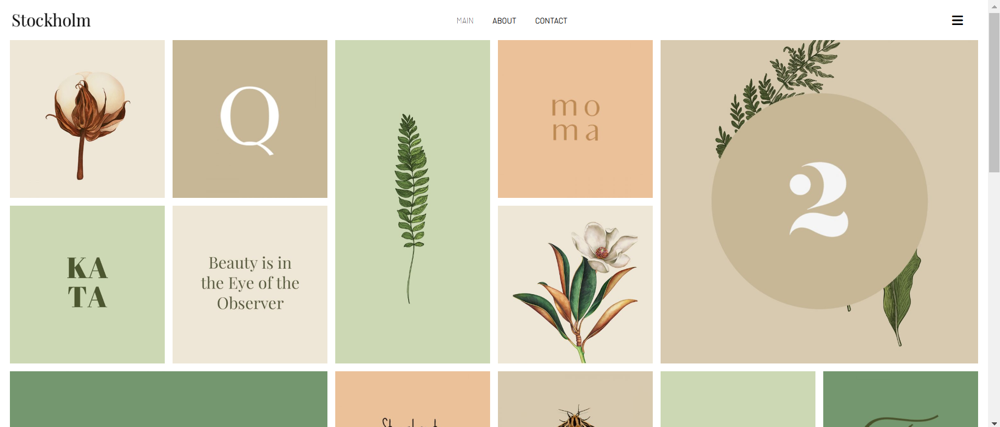

# Stockholm - Mi primer ejercicio de Programación

## 🚀 Características

- **Masonería de imágenes**: Presenta una cuadrícula de imágenes que se ajusta dinámicamente.

## 📸 Galería

Aquí hay una vista previa de lo que encontrarás en el proyecto:

    
    
    
    
    

## 🌐 Tecnologías utilizadas

- **HTML5**: Para la estructura del contenido.
- **CSS3**: Para el estilo y diseño.
- **Font Awesome**: Para iconos modernos y elegantes.

 ## 📧 Contacto
Si tienes preguntas o comentarios, no dudes en contactarme:

Email: judithfullstack@gmail.com
